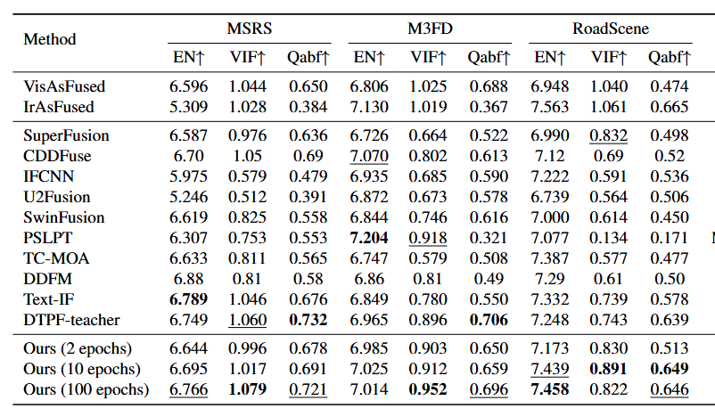
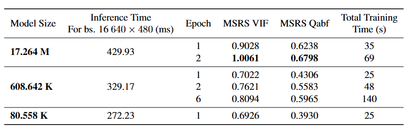
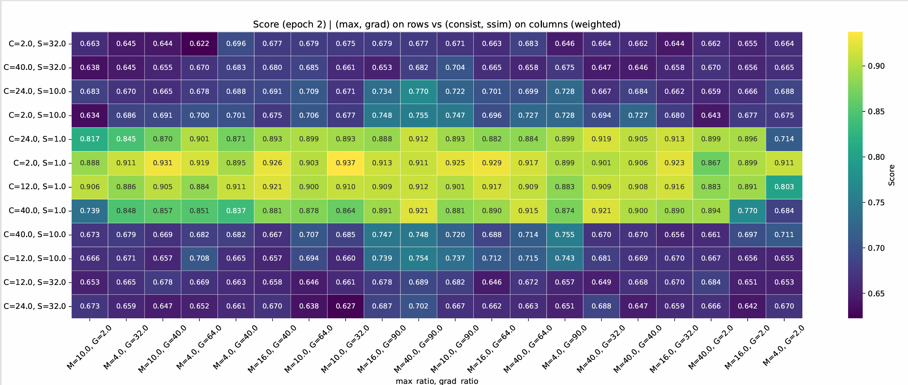

## Get a sota comparable image fusion model within 5 min from download dataset to reproduce metrics in paper. 

### Without GPU? Try on Colab!

[](https://colab.research.google.com/drive/1AEjTBT7bv5LLM9hGepCagWKGaXKEHmJm?usp=sharing)

### Environment(Windows or Ubuntu). (1 min)
1. Clone this repo
```
git clone https://github.com/Zirconium233/HybridFusion.git 
```

2. Python environment(make sure you have git and python first)
```
# If you not have an environment, install them first. 
# Otherwise, just use your local environment. 
pip install numpy torch accelerate torchvision matplotlib opencv-python
```

### Prepare dataset.  (3 min)
For MSRS(public): (641.22MiB download)
```
cd HybridFusion
mkdir -p data
cd data
git clone https://github.com/Linfeng-Tang/MSRS.git
cd ..
```
(Optional):
You can prepare other datasets for test. 
### Run the code.  (from 1 to 5 min, determined by your device and system)

Edit the train_ycbcr.py, 
```python
EPOCHS: int = 1 # change to 1 with small batch size
LR: float = 1e-4
KL_WEIGHT: float = 1e-5
LOSS_SCALE_FACTOR: float = 0.1
MIXED_PRECISION: str = "bf16"  # "no" | "fp16" | "bf16" For RTX 30 and above, use bf16; otherwise, switch to fp16, or "no" for fp32
PROJECT_DIR: str = "./checkpoints/stochastic_policy_ycbcr"
SAVE_IMAGES_TO_DIR: bool = True
TRAIN_BATCH_SIZE: int = 4 # change to 4 to avoid out of memory on 8GB device. 
TEST_BATCH_SIZE: int = 2
NUM_WORKERS: int = 4
GRAD_ACCUM_STEPS: int = 2
MAX_GRAD_NORM: float = 1.0
TEST_FREQ: int = 1
SAVE_FREQ: int = 1
METRIC_MODE: str = 'mu' # We added randomness to the method, but this randomness is a very poor implementation. Do not use 'sample'
SAVE_MODELS: bool = True
EVAL_CALLBACK = None
# ...existing code...
"MSRS": { # Default path
  "train": {"dir_A": "./data/MSRS/train/vi", 
            "dir_B": "./data/MSRS/train/ir"},
  "test":  {"dir_A": "./data/MSRS/test/vi",
            "dir_B": "./data/MSRS/test/ir"},
}
```
Run the code (no need for fixed seed, +- 0.02 on VIF and Qabf)
```
python train_ycbcr.py
```

The log on RTX 4060 Laptop (79w/140w power consumption, WSL2 Ubuntu 24.04LTS)
```
[Config] epochs=1, lr=0.0001, kl_w=1e-05, loss_scale=0.1, mp=bf16
[Dirs] project_dir=./checkpoints/stochastic_policy_ycbcr
Epoch 1/1: 100%|████████████████████████████████| 271/271 [02:18<00:00,  1.96it/s, loss=0.4655, fusion=4.65, kld=0.1871]
[Epoch 1] avg_total=0.5532  avg_fusion=5.5319  avg_kld=0.178146

[Eval] Epoch 1 - MSRS
[Metrics][MSRS] VIF=1.0011  Qabf=0.6805  SSIM=0.9854  Reward=1.0024  PSNR=64.8455  MSE=0.0345  CC=0.6079  SCD=1.5938  Nabf=0.0029  MI=3.6514  AG=3.4416  EN=6.6642  SF=5.8239  SD=41.2041
[Save] model -> ./checkpoints/stochastic_policy_ycbcr/epoch_1
[Final] model -> ./checkpoints/stochastic_policy_ycbcr/final
```

The log on RTX 4060 Laptop (81w/140w power consumption, windows)
**Note that we do not recommend running the code on windows because under the same conditions(GPU), it is 10 times slower than wsl2, and I don't know why.**
```
PS C:\Users\xxx\Desktop\code\experiment4\HybridFusion> python .\train_ycbcr.py
C:\Users\xxx\AppData\Local\Programs\Python\Python312\Lib\site-packages\accelerate\accelerator.py:530: UserWarning: `log_with=tensorboard` was passed but no supported trackers are currently installed.
  warnings.warn(f"`log_with={log_with}` was passed but no supported trackers are currently installed.")
[Config] epochs=2, lr=0.0001, kl_w=1e-05, loss_scale=0.1, mp=bf16
[Dirs] project_dir=./checkpoints/stochastic_policy_ycbcr
Epoch 1/1: 100%|████████████████████████████████████| 271/271 [18:47<00:00,  4.16s/it, loss=0.5364, fusion=5.36, kld=0.1876]
[Epoch 1] avg_total=0.5295  avg_fusion=5.2952  avg_kld=0.263806

[Eval] Epoch 1 - MSRS
[Metrics][MSRS] VIF=0.9973  Qabf=0.6805  SSIM=0.9712  Reward=0.9964  PSNR=65.0065  MSE=0.0329  CC=0.6074  SCD=1.5357  Nabf=0.0030  MI=3.4819  AG=3.4439  EN=6.6417  SF=5.8472  SD=40.3562
[Save] model -> ./checkpoints/stochastic_policy_ycbcr\epoch_1
[Final] model -> ./checkpoints/stochastic_policy_ycbcr/final
```

The log on Colab T4 GPU:
```
Launching training on one GPU.
[Config] epochs=1, lr=0.0001, kl_w=1e-05, loss_scale=0.1, mp=fp16
[Dirs] project_dir=/content/checkpoints/stochastic_policy_ycbcr
Epoch 1/1: 100%
 271/271 [05:06<00:00,  1.08s/it, loss=0.4307, fusion=4.31, kld=0.1597]
[Epoch 1] avg_total=0.4486  avg_fusion=4.4863  avg_kld=0.189771

[Eval] Epoch 1 - MSRS
[Metrics][MSRS] VIF=1.0161  Qabf=0.6912  SSIM=0.9950  Reward=1.0160
[Save] model -> /content/checkpoints/stochastic_policy_ycbcr/epoch_1
[Final] model -> /content/checkpoints/stochastic_policy_ycbcr/final
```

The log on RTX 4090 (389w/450w power consumption, Ubuntu)
```
/home/zhangran/miniconda3/envs/fusionrl/lib/python3.12/site-packages/accelerate/accelerator.py:530: UserWarning: `log_with=tensorboard` was passed but no supported trackers are currently installed.
  warnings.warn(f"`log_with={log_with}` was passed but no supported trackers are currently installed.")
[Config] epochs=10, lr=0.0001, kl_w=1e-05, loss_scale=0.1, mp=bf16
[Dirs] project_dir=./checkpoints/stochastic_policy_ycbcr_
[2025-09-05 20:54:30,905] [INFO] [real_accelerator.py:260:get_accelerator] Setting ds_accelerator to cuda (auto detect)
[2025-09-05 20:54:32,784] [INFO] [logging.py:107:log_dist] [Rank -1] [TorchCheckpointEngine] Initialized with serialization = False
Epoch 1/10: 100%|██████████████████████████████████████| 42/42 [00:30<00:00,  1.38it/s, loss=0.6532, fusion=6.53, kld=0.2343]
[Epoch 1] avg_total=0.7748  avg_fusion=7.7484  avg_kld=0.225301

[Eval] Epoch 1 - MSRS
[Metrics][MSRS] VIF=0.8738  Qabf=0.6060  SSIM=0.9405  Reward=0.9078  PSNR=66.0299  MSE=0.0245  CC=0.6314  SCD=1.5036  Nabf=0.0005  MI=2.7697  AG=2.9493  EN=6.4512  SF=5.3943  SD=35.2643

[Eval] Epoch 1 - M3FD
[Metrics][M3FD] VIF=0.7346  Qabf=0.3833  SSIM=0.9223  Reward=0.7439  PSNR=63.2525  MSE=0.0363  CC=0.5000  SCD=1.4085  Nabf=0.0003  MI=3.7661  AG=2.4486  EN=6.8696  SF=4.7131  SD=31.8636

[Eval] Epoch 1 - RS
[Metrics][RS] VIF=0.8157  Qabf=0.5783  SSIM=0.9635  Reward=0.8822  PSNR=63.3940  MSE=0.0356  CC=0.5891  SCD=1.3595  Nabf=0.0006  MI=4.3283  AG=3.9384  EN=7.2798  SF=6.5545  SD=42.0212

[Eval] Epoch 1 - PET
[Metrics][PET] VIF=0.8487  Qabf=0.7508  SSIM=1.2686  Reward=1.0812  PSNR=61.0182  MSE=0.0528  CC=0.7694  SCD=1.2543  Nabf=0.0002  MI=3.7903  AG=10.4499  EN=5.0579  SF=9.0170  SD=82.7149

[Eval] Epoch 1 - SPECT
[Metrics][SPECT] VIF=0.8824  Qabf=0.7518  SSIM=1.2495  Reward=1.0865  PSNR=67.1557  MSE=0.0147  CC=0.8573  SCD=0.9895  Nabf=0.0005  MI=3.8503  AG=5.5714  EN=4.5762  SF=8.0613  SD=55.2409

[Eval] Epoch 1 - CT
[Metrics][CT] VIF=0.6931  Qabf=0.5566  SSIM=0.9830  Reward=0.8370  PSNR=62.0092  MSE=0.0423  CC=0.7991  SCD=1.2204  Nabf=0.0009  MI=2.8351  AG=5.9145  EN=5.2691  SF=6.3949  SD=81.8531
[Save] model -> ./checkpoints/stochastic_policy_ycbcr_/epoch_1
Epoch 2/10: 100%|██████████████████████████████████████| 42/42 [00:29<00:00,  1.44it/s, loss=0.5490, fusion=5.49, kld=0.2453]
[Epoch 2] avg_total=0.6018  avg_fusion=6.0185  avg_kld=0.242903

[Eval] Epoch 2 - MSRS
[Metrics][MSRS] VIF=0.9706  Qabf=0.6676  SSIM=0.9589  Reward=0.9770  PSNR=65.3021  MSE=0.0302  CC=0.6158  SCD=1.5556  Nabf=0.0018  MI=3.2413  AG=3.3341  EN=6.6010  SF=5.7405  SD=39.4379

[Eval] Epoch 2 - M3FD
[Metrics][M3FD] VIF=0.8342  Qabf=0.5088  SSIM=0.9302  Reward=0.8425  PSNR=62.3475  MSE=0.0461  CC=0.4267  SCD=1.2120  Nabf=0.0018  MI=4.1244  AG=3.1712  EN=7.0902  SF=5.2955  SD=36.9624

[Eval] Epoch 2 - RS
[Metrics][RS] VIF=0.9239  Qabf=0.6264  SSIM=0.9538  Reward=0.9391  PSNR=62.6082  MSE=0.0432  CC=0.5479  SCD=1.2070  Nabf=0.0020  MI=5.2909  AG=4.3760  EN=7.4094  SF=6.8954  SD=47.0406

[Eval] Epoch 2 - PET
[Metrics][PET] VIF=0.9171  Qabf=0.7945  SSIM=1.2624  Reward=1.1238  PSNR=60.8927  MSE=0.0542  CC=0.7459  SCD=0.9662  Nabf=0.0005  MI=4.4592  AG=10.8572  EN=4.8804  SF=9.0729  SD=81.2387

[Eval] Epoch 2 - SPECT
[Metrics][SPECT] VIF=0.9437  Qabf=0.7705  SSIM=1.2485  Reward=1.1160  PSNR=66.8997  MSE=0.0154  CC=0.8473  SCD=0.7964  Nabf=0.0010  MI=4.3139  AG=5.8369  EN=4.5162  SF=8.1430  SD=55.2099

[Eval] Epoch 2 - CT
[Metrics][CT] VIF=0.7123  Qabf=0.5823  SSIM=0.9703  Reward=0.8521  PSNR=61.6643  MSE=0.0458  CC=0.7907  SCD=1.2058  Nabf=0.0036  MI=2.8066  AG=6.3607  EN=5.2605  SF=6.5936  SD=83.6986
[Save] model -> ./checkpoints/stochastic_policy_ycbcr_/epoch_2
```

## Compare the result with metrics in paper: 



## Why it works? 

### Frist: the size of the model(and the goal definition for model) determines the convergence speed



Feel free to enlarge the model, when you inference with a full size image, there won't be much difference in speed between the 80k model and the 17M model. 

### Second: Loss decides the up-bond for metrics. 

The default loss you used 
240 groups loss grid search. 



## Issues:

1. Q: The kld loss and sampling is for what? 
A: At first, we intended to construct random methods that could be optimized by reinforcement learning for non-differentiable indicators such as human feed back. Then, during the pre-training, we found that hybrid methods was so powerful that achieve sota for 100 steps. By the way, this sample process is actually very poorly designed and is not recommended for use.

2. Worry about high metrics low performance? 
See `checkpoints/stochastic_policy_ycbcr/images` after running the code to see generated images. 

